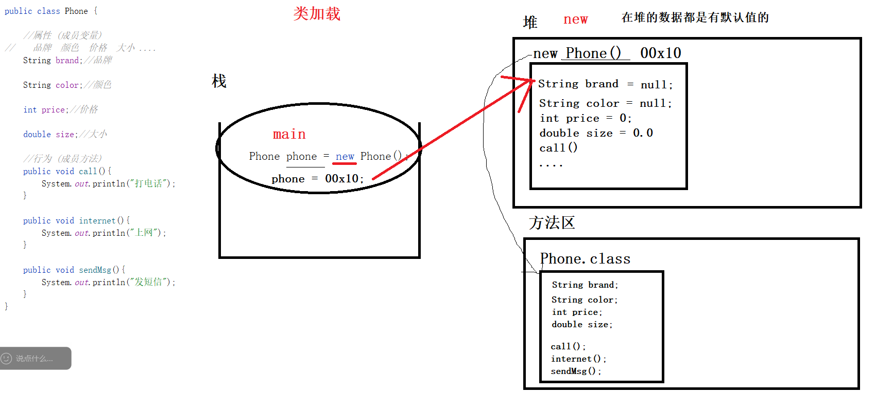
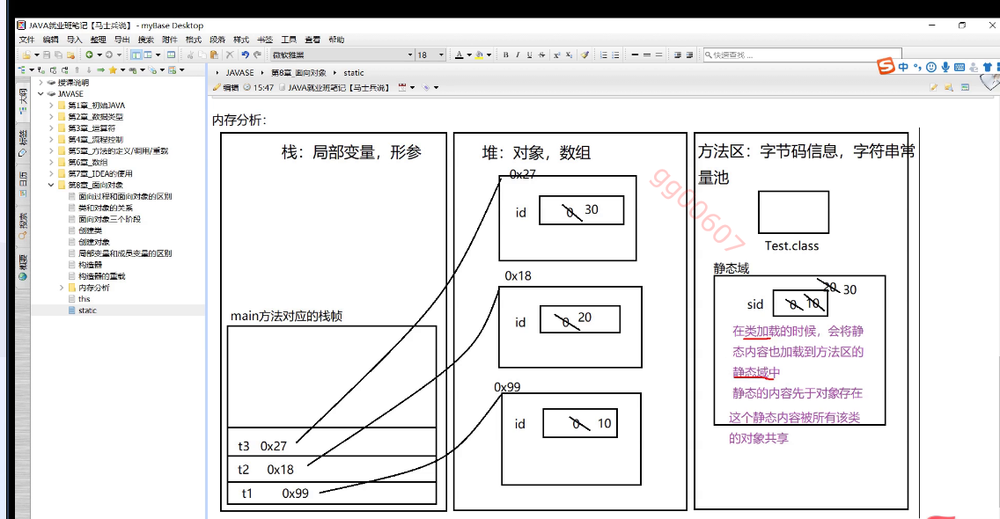

# 面向对象

## 面向过程

```properties
1
在程序设计的早期，程序用流程图和自顶向下的方法设计。采用这种设计方法，程序员会将一个大的问题分解成更小的任务，然后为每个更小的任务编写一个过程（或函数）。最后，程序员会编写一个主过程来启动程序流程，随后根据程序流程走向，调用想要的其它过程。这种类型的程序设计被称为结构化编程
2
​
3
面向方法编程，为了完成某个任务而编写的一堆方法
```

洗衣服: 拿出衣服---泡入水中--倒入洗衣粉---搓衣服---清洗---拧干---晒衣服

## 面向对象

制造洗衣机 (类别，图纸，模版)

某一台洗衣机（才具备具体的洗衣服能力）对象   实例

相同的一些功能

```properties
1
围绕着要解决的问题中的对象来设计。 
```

## 什么是对象

```properties
一个类只能有一个直接父类

要想实现多继承，只能用传递继承
```

```什么是类
```properties
1
是具有相同特性的对象的分类
```

## 类和对象的关系

```properties
1
类是对象的抽象(模版)
2
​
3
对象是类的实例
4
​
5
类是一种具体相同属性和行为的一组对象的集合
```


## 编写一个类 

比如:手机类

属性:

​	品牌  颜色  价格  大小 ....

行为:

​	打电话 上网 发短信 ....


```java
1
​
2
public class Phone {
3
​
4
    //属性 (成员变量)
5
//    品牌  颜色  价格  大小 ....
6
    String brand;//品牌
7
​
8
    String color;//颜色
9
​
10
    int price;//价格
11
​
12
    double size;//大小
13
​
14
    //行为 (成员方法)
15
    public void call(){
16
        System.out.println("打电话");
17
    }
18
​
19
    public void internet(){
20
        System.out.println("上网");
21
    }
22
​
23
    public void sendMsg(){
24
        System.out.println("发短信");
25
    }
26
}
27
​
```


练习：  设计一个汽车类

​    属性: 

​			品牌  颜色  价格  排量  .....

​	行为: 

​		跑   倒车 ....


## 创建对象

## properties

1
类名 对象名  = new 类名();
##



```对象创建时的内存图


```java
1
        //创建对象   类名  对象名
2
        Phone phone = new Phone();
3
​
4
        System.out.println();
```

`new` 关键字在生成一个对象时会为对象开辟内存空间

`new` 关键字在生成一个对象时会调用类的构造方法

`new` 关键字在生成一个对象时会将生成的对象的地址返回

Java **不止** 通过 `new` 关键字创建对象，还可以使用：

- **反射机制**（`Class.forName().newInstance()`）
- **克隆对象**（`Object.clone()`）
- **反序列化**（`ObjectInputStream` 读取已序列化的对象）

## 多个对象的内存


## 对象的使用

## 1,通过对象访问属性

```properties
1
获取属性值:  对象名.属性名
2
修改属性值:  对象名.属性名 = 新的值
```

## 2,通过对象访问方法

```properties
1
对象名.方法名();
```

- 

```properties
1
包实则对应的磁盘中文件夹
2
​
3
包在程序中是用来管理类的
```

```
1
package service;  //表示当前类所在的包的位置
```

注意：

- 在同一个包中使用其他类不需要导包，直接用

- 在不同的包中使用其他包中的类，需要导入包  import 包名

  ```java
  1
  import entiry.User;  //导入制定类
  2
  ​
  3
  import entiry.*;  //导入包中所有类
  ```

- java.lang包下的类可以直接使用(不需要导包)

## 访问修饰符

| 访问修饰符 | 说明                                   |
| ---------- | -------------------------------------- |
| public     | 公共的,在程序的中任意地方可以访问      |
| protected  | 受保护的 可以在当前包中,不同包的子类中 |
| 默认的     | 默认的  只能在当前包中                 |
| private    | 私有的  只能在当前类中                 |


### public

```properties
1
 修饰类  
2
     一个源文件里面只能有一个public的类，并且此public的类要和源文件名字一致
3
     public 默认的可以修饰源文件的类(抛开内部类)
4
 修饰成员变量，方法
```

 ```protected
```properties
1
 修饰成员变量，方法
2
 受保护的 可以在当前包中,不同包的子类中 (和继承相关)
 ```

## 默认的(不写)

### properties

1
 类,修饰成员变量，方法
2
 受保护的 可以在当前包中,不同包的子类中 (和继承相关)
###

### private

```properties
1
 私有的
2
 成员变量，方法
3
 只能在当前类中使用
```


对象使用时注意

```{0}如果把对象作为值赋值时，是引用赋值
```{0}如果把对象作为参数，是引用传参

## java
1
​
2
    public static void main(String[] args) {
3
​
4
        Phone phone1 = new Phone();
5
​
6
//        Phone phone2 = phone1;//引用赋值
7
//
8
        phone1.brand = "华为";
9
//
10
//        phone2.brand = "苹果";
11
//
12
////        System.out.println(phone1.brand);
13
////
14
////        System.out.println(phone2.brand);
15
//
16
//        System.out.println(phone1 == phone2);
17
​
18
        changePhone(phone1);
19
​
20
        System.out.println(phone1.brand);
21
​
22
    }
23
​
24
    public static void changePhone(Phone a){ 
25
​
26
        a.brand = "小米";
27
    }
##

```面向对象的三大特性

```properties
1
封装，继承，多态
```

### 封装

```properties
1
•封装•：封装是指将数据和操作数据的方法捆绑在一起，形成一个独立的单元。在面向对象编程中，封装通过访问控制关键词（如public、private、protected）来实现，目的是隐藏对象的内部实现细节，控制对象的修改及访问的权限。封装可以提高代码的可维护性和复用性，降低代码之间的耦合度
2
​
3
​
4
通俗易懂:
5
    使用访问修饰符控制值的有效性和安全性，对外提供访问接口
```

实现封装:

- 将属性私有化

- 提供对外的getter和setter方法

一般对只存放数据的类做这样的操作,对外可以成为实体类，还可以成为javabean,pojo

```java
1
​
2
public class Person {
3
​
4
    private String name;
5
​
6
    private char sex;
7
​
8
    private int age;
9
​
10
    public String getName() {
11
        return name;
12
    }
13
​
14
    public void setName(String name) {
15
        this.name = name;
16
    }
17
​
18
    public char getSex() {
19
        return sex;
20
    }
21
​
22
    public void setSex(char sex) {
23
        this.sex = sex;
24
    }
25
​
26
    public int getAge() {
27
        return age;
28
    }
29
​
30
    public void setAge(int age) {
31
        this.age = age;
32
    }
33
}
34
​
```

练习:

​	创建一个用户类

​		数据信息:  用户名   密码   手机号码  邮箱


## 成员变量

```properties
1
声明的位置:
2
    类中
3
内存地址:
4
    堆中
5
作用域:
6
    整个类中
7
访问修饰符:
8
    可以使用访问修饰符
9
生命周期:
10
    随着对象的创建而创建，对象销毁而销毁
```


# 局部变量

```properties
1
声明的位置:
2
    方法中或者参数中
3
内存地址:
4
    栈
5
作用域:
6
    只能在方法中
7
访问修饰符:
8
    不可以使用访问修饰符
9
生命周期:
10
  随着方法的调用而创建,方法的结束而销毁
```

## this关键字

```properties
1
如果当局部变量和成员变量名字相同时
2
可以通过this区分成员变量和局部变量
```

```java
1
    public void setName(String name) {
2
        this.name = name;
3
​
4
    }
```

this可以修饰属性名，构造器以及方法

## static修饰符

static：可以修饰属性，方法，内部类，代码块

```java
public class Test {
    int id;
    static int sid;

    public static int getSid() {
        return sid;
    }

    @Override
    public String toString() {
        return "Test{" +
                "id=" + id +
                "  sid=" + getSid() +
                '}';
    }

    public static void main(String[] args) {
        Test test1=new Test();
        test1.id=10;
        test1.sid=10;
        Test test2=new Test();
        test2.id=20;
        test2.sid=20;
        Test test3=new Test();
        test3.id=30;
        test3.sid=30;


        System.out.println(test1);
        System.out.println(test2);
        System.out.println(test3);
    }
}
```

结果为：

```java
Test{id=10  sid=30}
Test{id=20  sid=30}
Test{id=30  sid=30}
```

### 原因



### static修饰属性总结

1.在类加载的时候一起加载入方法的静态域中

2.先于对象存在

3.访问方式：对象名.属性名；类名.属性名(推荐)

static修饰属性应用场景：某些特定的数据想要在内存中共享，只有一块-》这种情况下，就可以用static修饰属性（类变量）

### static修饰方法

```java
public class Test {
    int id;
    static int sid;

    public void a(){
        System.out.println("a--------");
        System.out.println(id);
        System.out.println(sid);
    }
    static public void b(){
        System.out.println("b---------");
        a();//静态方法中不能访问非静态方法
        this.id//静态方法中不能使用this关键字
        System.out.println(id);//静态方法中不能访问非静态属性
        System.out.println(sid);
    }


    public static void main(String[] args) {
    Test test=new Test();
    test.a();//非静态的方法可以用对象名.方法名去调用。
         test.b();//静态的方法可以用 对象名.方法名去调用 也可以用 类名.方法名（推荐）
         Test.b();

    }
}
```


## 方法的重载

```properties
1
在同一个类中,做同一件事件，所需的条件不一样，(实现细节也可能不一样，结果也可能不一样)
2
​
3
方法名相同，参数列表不同
4
​
5
和访问修饰符，返回值类型无关
```

参数列表不同

- 个数相同的情况下，数据类型不同
- 数据类型相同的情况下，个数不同

在声明方法时，在同一个类中，不允许有同样名字并且参数相同的方法


## 构造方法

```properties
1
方法名和类名相同
```

无参构造方法

默认情况下，每个类都有无参是构造方法，一旦这个类有了有参的构造方法，默认那个无参的构造方法会丢失

```java
 public Phone(){
        
 }
```

当对象被创建时，自动调用构造方法

```java
Phone phone1 = new Phone();
```

## 构造方法传参

目的:为了给对像做初始化

```java
    public Phone(String brand,String color){
        this.brand = brand;
        this.color = color;

    }
```

```java
Phone phone1 = new Phone("华为","黑色");
```

可以通过this()在构造方法中调用其他构造方法

使用时，必须放在构造方法的第一行


# 练习

奥特曼打小怪兽

   思路:  

```
- 设计两个类 (奥特曼   小怪兽)  要求，只存属性(名字，生命值，攻击力)，使用封装设计,放在entity包中
- 设计两个类 奥特曼的攻击类  小怪兽的攻击类 (放在service包中)
- 奥特曼的攻击类中设计    一个攻击小怪兽的方法  attack(奥特曼,小怪兽);  小怪兽的血量要减少(减奥特曼的攻击力)
- 小怪兽的攻击类中设计 一个攻击奥特曼的方法  attack(奥特曼,小怪兽); 奥特曼的血量要减少(减小怪兽的攻击力)
```

奥特曼类:

```java
public class UltraMan {

    //名字
    private String name;
    //生命值
    private int  hp;
    //攻击力
    private int atk;

    //防御值....


    public String getName() {
        return name;
    }

    public void setName(String name) {
        this.name = name;
    }

    public int getHp() {
        return hp;
    }

    public void setHp(int hp) {
        this.hp = hp;
    }

    public int getAtk() {
        return atk;
    }

    public void setAtk(int atk) {
        this.atk = atk;
    }
}
```

小怪兽类:

```java
/**
 * 小怪兽
 */
public class Monster {
    //名字
    private String name;
    //生命值
    private int  hp;
    //攻击力
    private int atk;

    public String getName() {
        return name;
    }

    public void setName(String name) {
        this.name = name;
    }

    public int getHp() {
        return hp;
    }

    public void setHp(int hp) {
        this.hp = hp;
    }

    public int getAtk() {
        return atk;
    }

    public void setAtk(int atk) {
        this.atk = atk;
    }
}

```

奥特曼攻击类:

```java
/**
 * 奥特曼的攻击类
 */
public class UltraManAttack {


    /**
     * 奥特曼攻击小怪兽的方法
     */
    public void ultraManAttackMonster(UltraMan ultraMan, Monster monster){
        //攻击实现细节

        //小怪兽掉血  掉奥特曼的攻击力
       int atk =  ultraMan.getAtk();

        //受伤后的生命值 = 获取原本的生命值-攻击力
        int hp = monster.getHp()-atk;

        monster.setHp(hp);
    }

}

```

小怪兽攻击类:

```java
public class MonsterAttack {


    /**
     * 小怪兽攻击奥特曼的方法
     */
    public void monsterAttackUltraMan(UltraMan ultraMan, Monster monster){
        //攻击实现细节

        //奥特曼掉血  掉小怪兽的攻击力
        int atk =  monster.getAtk();

        //受伤后的生命值 = 获取原本的生命值-攻击力
        int hp = ultraMan.getHp()-atk;

        ultraMan.setHp(hp);
    }
}

```

下一步：

​	要求:  初始化一个奥特曼对象，一个小怪兽对象     （通过构造方法初始化）

```java
  public UltraMan(String name, int hp, int atk) {
        this.name = name;
        this.hp = hp;
        this.atk = atk;
    }


  public Monster(String name, int hp, int atk) {
        this.name = name;
        this.hp = hp;
        this.atk = atk;
  }


        //创建一个奥特曼对象并对其初始化
        UltraMan ultraMan = new UltraMan("迪迦奥特曼",400,30);

        //创建一个小怪兽的对象并对其初始化
        Monster monster = new Monster("哥斯拉",500,40);
```


